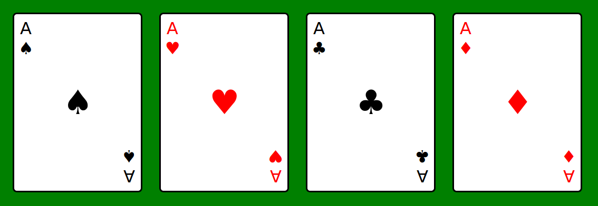

# Assignment

Create an HTML document and a CSS stylesheet to display the following layout of playing cards:

The size of the cards must be 2.5 × 3.5 inches. Provide a solution using [Flexbox](https://developer.mozilla.org/en-US/docs/Learn/CSS/CSS_layout/Flexbox) layout. The assignment requires the [`transform`](https://developer.mozilla.org/en-US/docs/Web/CSS/transform) CSS property and the [`rotate()`](https://developer.mozilla.org/en-US/docs/Web/CSS/transform-function/rotate) transformation function to get the desired layout.

The Unicode playing card symbols can be found [here](https://unicode.org/charts/PDF/U2600.pdf).
