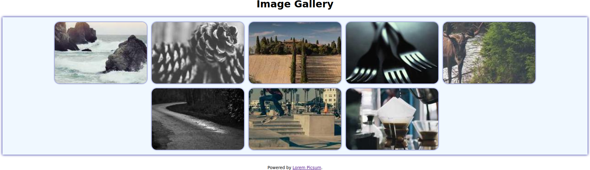

# Assignment

Create an HTML document and a CSS stylesheet to display eight random images as follows:

You must use the  [Flexbox](https://developer.mozilla.org/en-US/docs/Learn/CSS/CSS_layout/Flexbox) layout. Use random images of size $300 \times 200$ pixels taken from [Lorem Picsum](https://picsum.photos/). Use the image URLs <https://picsum.photos/300/200?random=1>, <https://picsum.photos/300/200?random=2>, <https://picsum.photos/300/200?random=1>, and so on.

The layout must be responsive, i.e., as many images as possible must be shown in a row.
