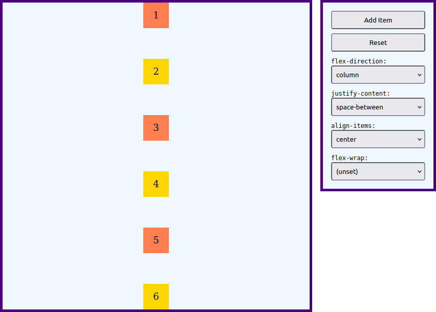

# Assignment

Create an HTML document and a CSS stylesheet to implement the interactive [Flexbox](https://developer.mozilla.org/en-US/docs/Learn/CSS/CSS_layout/Flexbox) demonstration web page below:

The values available from the dropdown lists can be found below:

* [flex-direction](https://developer.mozilla.org/en-US/docs/Web/CSS/flex-direction)
* [justify-content](https://developer.mozilla.org/en-US/docs/Web/CSS/justify-content)
* [align-items](https://developer.mozilla.org/en-US/docs/Web/CSS/align-items)
* [flex-wrap](https://developer.mozilla.org/en-US/docs/Web/CSS/flex-wrap)

The flex container on the left should be initially empty.
